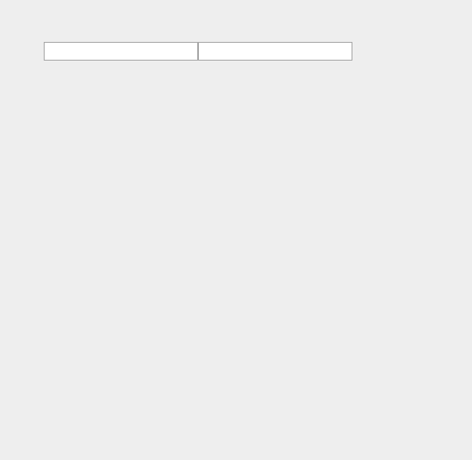

# datepicker
> 日期选择控件，依赖jquery，代码简单，小巧，只提供最基本的功能，可以自己进行二次开发，自定义样式，保持更新。

## 最后更新日期 2015-10-21


### 演示
- 日期选择
[http://www.qinshenxue.com/demo/datepicker/index.html](http://www.qinshenxue.com/demo/datepicker/index.html)


### 配置

#### weekStart
- 类型：Number
- 默认：0（星期日）
- 解释：定义周从星期几开始
- 可能的值：0（星期日）、1（星期一）、2、3、4、5、6

#### lang
- 类型：String
- 默认：zh_CN（中文）
- 解释：国际化语言包
- 可能的值：可自己添加


### 示例
```html
<link rel="stylesheet" type="text/css" href="datepicker.css">
<script src="jquery.js"></script>
<script src="datepicker.js"></script>
<input type="text" id="test">
<script>
$('#test').datepicker();
</script>
```
### 效果
